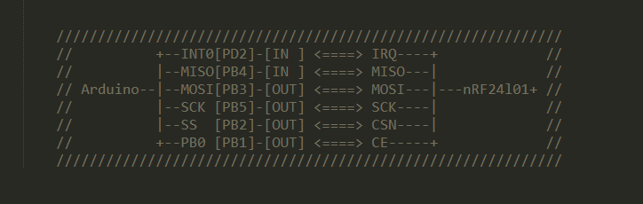
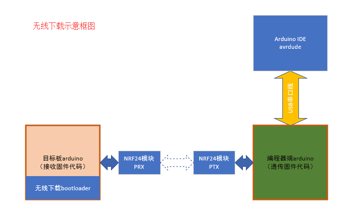
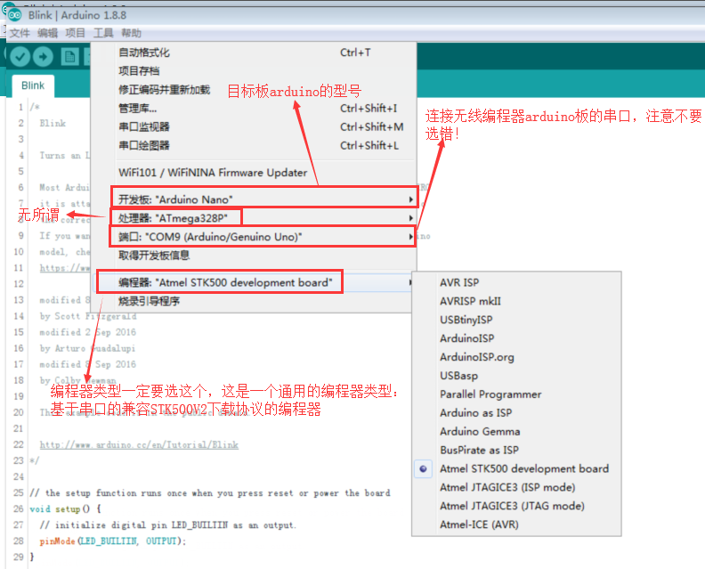
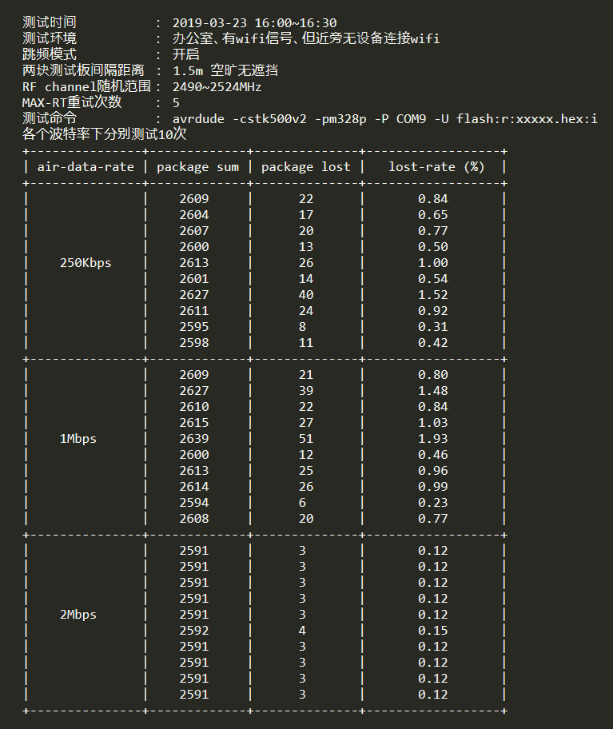
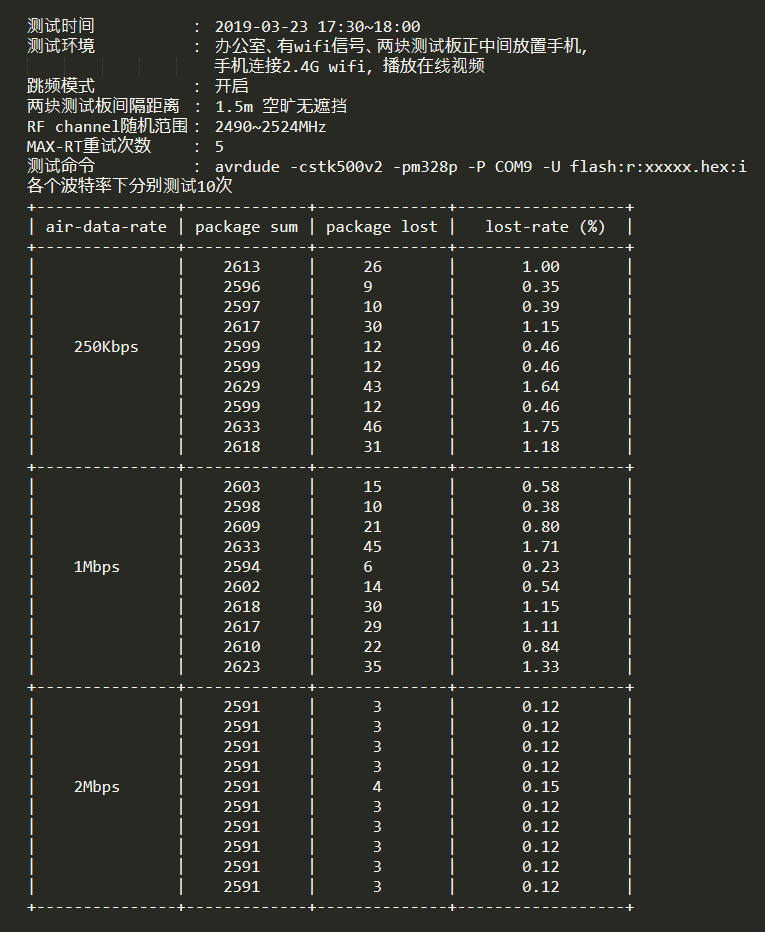
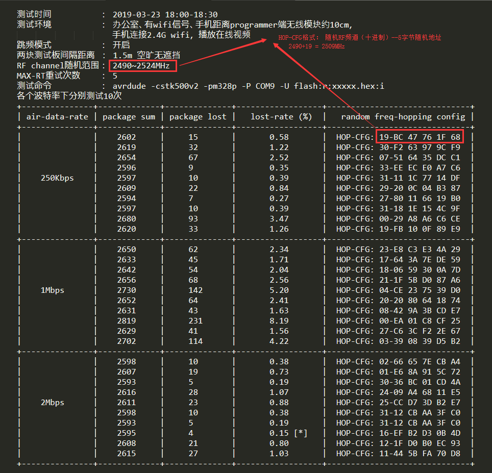
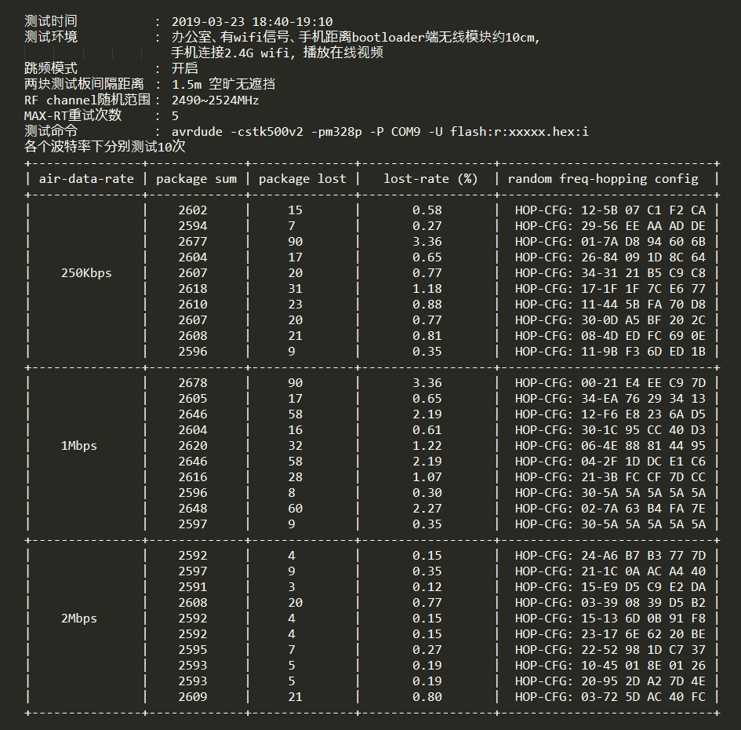

# arduino-nrf2401-bootloader

## 介绍
这是一个专门为arduino UNO/Nano/Pro Mini打造的无线下载bootloader,可通过NRF24L01+模块或串口烧写程序.2 Kb Flash.兼容STK500V2协议,支持avrdude,支持arduino IDE,支持跳频传输,附带编程器端实现代码.     

注: 项目内附带的编程器端代码是arduino IDE简化版, 完整项目链接:  https://gitee.com/alicedodo/arduino-nrf2401-programmer 

## 特点:     
#### 1.  兼容STK500V2下载协议    
实现了协议中的通用命令以及ISP命令子集:  Flash读+写 / EEPROM读+写 / 熔丝位只读.    
通过无线编程器和avrdude通信,完成程序下载.       
所谓的无线编程器仅仅是数据透传,相当于无线串口,作用是从PC串口接收一帧命令,不做解析,通过NRF24L01+模块分包发送给bootloader.       
bootloader执行命令完毕后,再将命令的ACK帧分包发送给无线编程器,再由串口送达avrdude.      
精力有限,只使用avrdude5.10 和 avrdud6.3测试过,不保证其他版本没问题.       
5.10是winAVR2010内置avrdude版本;
6.3是当前官方最新版本.
#### 2. 支持两种下载接口: nrf24L01P-on-SPI 或者 串口 
bootloader默认优先使用无线模块接收数据,当检测不到无线模块时,启用串口(115200bps).
只在复位后检测一次,中途不再切换.
#### 3. 支持简易的跳频通信 
复位后bootloader在 [默认空中波特率+默认地址+默认频道]上监听握手信号,programmer端将 [新的空中波特率+随机频道+随机地址] 打包进握手信号,握手成功后双方一起修改配置,转移到新的频道继续通信.      
跳频命令是基于STK500V2的协议格式实现的,在bootloader看来和其他命令没有任何区别,所以理论上双方可以多次跳频.        

## 如何接线：    
默认连线图：      
    
## 如何编译：    
1. 修改Makefile中定义的串口号，根据你自己的情况修改 DEVICE_PORT       
2. 编译： make              
3. 使用usbasp烧写: make upload (upload命令先烧写熔丝位，再烧写代码)   
4. 由于SPI-CLK引脚正好连上了板载的LED，所以无线下载bootloader没办法像arduino官方bootloader那样闪烁LED提示正在运行，因此烧写完毕后需要测试一下能否正常工作，请按照下文描述的测试方法测试一下      
      
（如果你使用的交叉工具链是winAVR2010的话，还是不要自己编译了。winAVR已经快十年没更新了，内置的avr-gcc还是4.3版本，编译效率比较低，bootloader绝对会超过2Kb,建议换更高版本的，我自己使用的是5.4 ）          
        

（对于没有条件自己编译的各位，我上传了编译好的HEX文件，使用上图中的默认连线方式，文件位于bin目录下，烧写前需要先想办法修改熔丝位，配置： lfuse:0xFF / hfuse:0xDA / efuse:0xFD  ）      

## 如何测试bootloader:
1. 拔掉nrf24l01+模块，然后将烧写好的目标板串口线连接PC并找出对应的串口设备      
2. 输入测试命令 avrdude -cstk500v2 -pm328p -P COMx/ttyUSBx/ttyACMx -U flash:r:test_read.hex:i        
3. 如果你能看到命令正常执行完毕，那么恭喜你，bootloader已经成功运行了。      
4. 请注意，这个地方存在一个问题：      
   当你把烧写了本bootloader的arduino第一次连接上PC时，上述测试命令可正常执行，但如果不重新插拔USB线，而直接再次运行这个测试命令的话，arduino不会有反应，命令会超时，原因是二次执行此命令时，板载的自动复位电路不会触发，从而导致bootloader无法得到执行。      
   这当然不会是bootloader的BUG，arduino上运行任何代码也不会禁用板载的自动复位电路，真正的原因是avrdude（我使用的是6.3，其他版本没试过）在使用命令选项-cstk500v2时存在的BUG，我给出的证明是:       
   1. 随便找个串口助手工具，多次打开关闭和arduino相连的COM口，arduino必定会复位；       
   2. 每次在串口工具关闭COM口之后再执行上述测试命令，arduino必定会复位，命令也会正常执行      
## arduino IDE中如何使用bootloader下载程序：
       
1. 检查两块板各自的连线，确保正常（如果你没改过代码的话，两块板和NRF24L01模块之间的连线是完全一样的）。       
2. 使用arduino IDE打开arduino-nrf2401-programmer目录下的arduino-nrf2401-programmer.ino     
3. 编译这个工程并下载到充当无线编程器的arduino板上       
4. IDE中打开你要给目标板烧写的程序，编译之      
5. 烧写目标板前对IDE进行必要的配置（这里以官方自带例程Blink为例子）：       
        
6. 烧写： "项目" ==> "使用编程器上传"        
注意：这一步和我们正常下载程序不大一样：      
无线编程器无法接触到目标板，所以没办法像串口下载那样直接使目标板上的m328p复位，只能是手动及时复位目标板。      
具体方法是: 启动烧写之后，注意观察IDE左下角的状态提示，如果出现了"上传中...."之类的字样，立即手动复位目标板。     
稍晚的话就会下载失败，因为复位之后，目标板的bootloader仅仅等待下载信号1秒钟，超时了就会跳转至APP代码区去执行固件。
## 丢包率测试结果：    
1. 无2.4G wifi设备干扰    

2. 2.4G wifi设备轻微干扰    
      
3. 2.4G wifi设备编程器端重度干扰
     
4. 2.4G wifi设备bootloader端重度干扰      

## 结尾：    
时间所限，暂时写这些，如果大家感兴趣，请留言提醒，我可以在代码具体实现上补一些文档。

